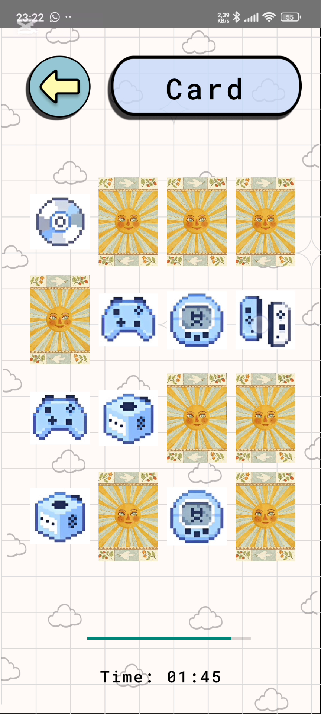
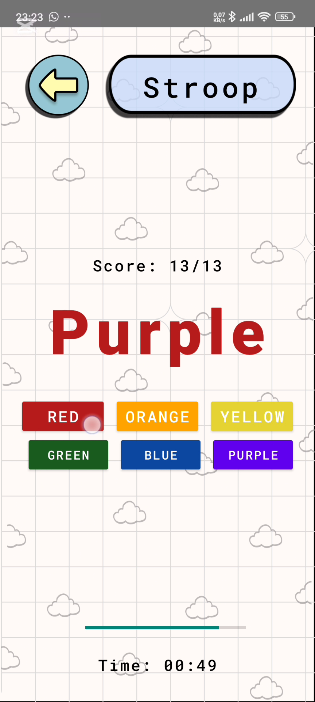

# RetroByte-Blitz
Brain training game inspired by the old Brain Champion Nokia game.

## Features
- Four surprise **_daily exercises_**, one from each category, to compete against friends
- **_Leaderboard_** and statistics line graph with the **_progress per brain area_**
- **_Calendar_** to track the finishing of daily exercises
- 12 games across **_4 categories_** to play at leisure
- Account with own avatar picture and stored progress
## Walkthrough
**Register** and **login** with a valid account.

  

From the _main menu_ choose either the **daily exercises** option or any of the **categories**. There are short instructions before each game.

**Daily exercises:**

 

Leaving mid-game does not save the score or pause the mini game.

The score of daily exercises counts towards the _leaderboard_ for the day.

 

Press the **chart** icon in the bottom navigation menu to access the _statistics_. A graph with the progress per category covers the last 10 fully completed days. The calendar showcases how many daily games out of 4 were completed on a certain day.


Press the **gear** icon in the bottom navigation menu to open the Settings drawer. From here change the _username, profile picture or log out_ . Detailed instructions for each game are below.

 

---
### Logic category:

- **Number of:** Count the number of appearances of a certain character
  
  
  
- **Sudoku:** Classic sudoku game

  
  
- **Slider:** Complete the puzzle by switching pieces 2 at a time
    - Take you own picture or use the default one.
      
   

### Memory category:
- **Colors:** Remember and recreate the shown color sequence

  
  
- **Grid:** Remember which squares light up and click to turn them on

  
  
- **Card:** Match pairs of identical objects
  
  
  
### Calculation category:
- **Calculation:** Perform arithmetic operations and enter the result

  
  
- **Sequence:** Complete the arithmetic or geometric sequence with the next term

  
  
- **Moving Sum:** Enter the sum of the moving numbers

  

### Visual category:
- **Descending:** Count the characters and place them in descending order of number of occurances

  
  
- **Stroop:** Identify the color a word is displayed in, ignoring the meaning (the word “Blue” printed in red ink should be answered as “Red”)

  
  
- **Roman numerals:** Match pairs of Arab and Roman numberals

  

## Installation
You can run the app locally via Android Studio or install the APK manually from the [Releases](../../releases) page.

### Option 1: Run via Android Studio

1. **Clone the repository**

   ```bash
   git clone https://github.com/your-username/brain-training-game.git
   ```

2. **Open the project in Android Studio**

3. **Build the project**

     Android Studio will prompt you to sync Gradle and download dependencies.

4. **Run the app on a device or emulator**

   *  **To use an Android device**:
      * Connect it via USB and enable **Developer Options** > **USB Debugging**
      * Your device should appear under "Available Devices" in the Run menu
   *  **To use an emulator**:

      * Go to **Tools > Device Manager** in Android Studio
      * Click **Create Device**, choose a phone model (e.g., Medium Phone), and select a system image (e.g., API 30)
      * Start the emulator and run the app

### Option 2: Install the APK

1. Visit the [Releases](../../releases) section
2. Download the latest `.apk` file
3. Transfer the APK to your Android device
4. Open it and follow prompts to install
   *(Allow "Install from unknown sources" if prompted)*

